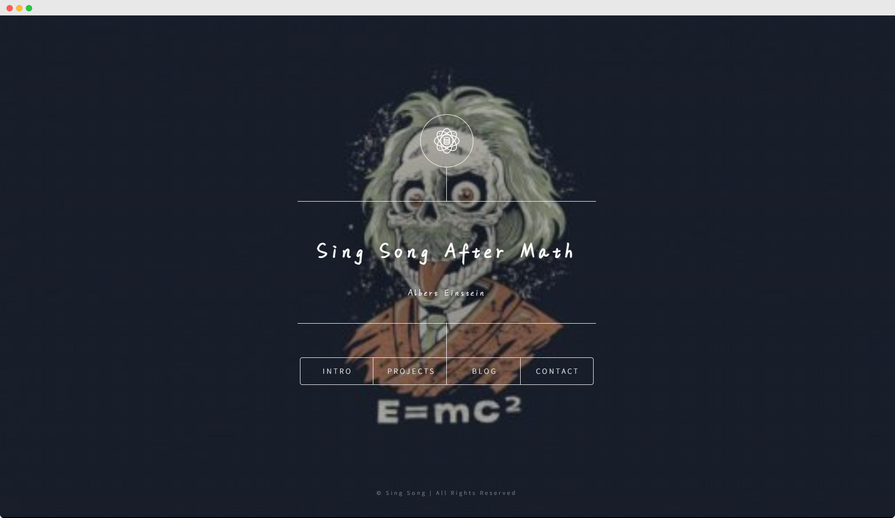

<div align="center">

<h1>Portoflio-Dimension</h1>

<h6>A Website template based on HTML5 Up-Dimension integrated with <a href="https://getbootstrap.com/docs/5.0/getting-started/introduction/">Boostrap</a> v5.0, <a href="https://fontawesome.com/v5/search">Font Awesome</a> v5.15.4, and <a href="https://formsubmit.co/">Formsubmit</a> Functionality</h6>

<a href="https://portfolio-dimension-sang-buster.vercel.app/" _target="blank">

</a>

[](https://portfolio-dimension-sang-buster.vercel.app/)

---

<h3>🚀 Set-up</h3>

</div>

Clone this repository to a location of your choice

```bash
git clone https://github.com/Sang-Buster/Portfolio-Dimension.git && cd Portfolio-Dimension && cd src
```
Then use any tools you wish to open/edit `index.html` and enjoy!
